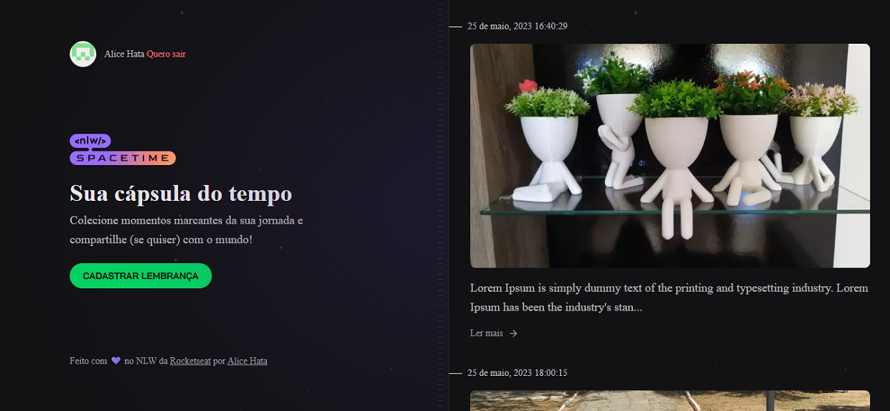

# NLW Spacetime: Front-end (Trilha Ignite)



Este é um projeto [Next.js](https://nextjs.org/) criado com [`create-next-app`](https://github.com/vercel/next.js/tree/canary/packages/create-next-app).


## Aula 1 - Iniciando o projeto

- React + NextJS
- Conceitos de react: componentes, propriedades e roteamento.
- TailwindCSS
- ESLint + Prettier Tailwind

Adicionamos as configurações de ESLint da Rocketseat com o comando `npm i @rocketseat/eslint-config -D` e o plugin prettier tailwind com o comando `npm i prettier-plugin-tailwindcss -D`.

## Começando

Para rodar o servidor em modo de desenvolvimento:

```bash
npm run dev
# or
yarn dev
# or
pnpm dev
```

Abra [http://localhost:3000](http://localhost:3000) com seu navegador para ver o resultado.

Este projeto usa [`next/font`](https://nextjs.org/docs/basic-features/font-optimization) para otimizar automaticamente e carregar o Inter,uma fonte customizada do Google.

- [Documentação Next.js](https://nextjs.org/docs) - aprenda sobre recursos e API do Next.js.
- [Aprenda Next.js](https://nextjs.org/learn) - um tutorial interativo Next.js.

## Aula 2 - Layout front-end

- Fontes: roboto e Bai Jamjuree
- Estrutura visual da Home
  - Blur background
  - Stripes
- Lista de memórias vazia
- Perfil de usuário
- Seção Hero
- Copyright

## Aula 3 - Autenticação

- Fluxo de autenticação
- Configuração Github OAuth
- Obtendo Github `code` web
- Salvando token nos cookies
- Exibindo perfil do usuário

OAuth significa 'Autorização Aberta', é um padrão que permite que um site ou aplicativo acesse recursos hospedados por outros aplicativos da Web em nome de um usuário.

Na prática, usaremos recursos do Github, o front-end fará requisição de login com usuário no Github, que por sua vez retornará informações do usuário válido junto com um 'código de troca'.

O código de troca irá para o back-end que fará uma requisição ao Github que retornará um 'token de acesso'.

O token de acesso permite identificar o usuário e fazer chamadas ao Github como se fosse o usuário.

Na configuração Github OAuth, usamos CLIENT_ID e CLIENT_SECRET no novo OAuth criado e chamamos de `NLW_Spacetime(dev)`.

Adicionamos o CLIENT_ID na requisição de login no Github Oauth e na rota `api/callback` recebemos o código de troca, usamos ele para fazer a requisição ao back-end, como resposta temos o token que salvamos nos cookies.

Para extrair as informações do usuário precisamos decodificar as informações gerado pelo jwt, para isso, usamos o jwt-decode e o instalamos com o comando `npm i jwt-decode`.

Usando o método decode do jwt-decode pegamos as informações do usuário para ser exibido no componente Profile.

Obs: Imagens externas devem ser informadas nas configurações do Next.

## Aula 4 - Rotas, Middleware e Nova memória(Layout)

- Definindo layout das rotas
- Rota de logout
- Página de nova memória
- Middleware de autenticação

Para facilitar na aplicação de CSS com o tailwind no elemento de formulário instalamos o @tailwindcss/forms com o comando `npm install -D @tailwindcss/forms` como dependência de desenvolvimento.

## Aula 5 - Criação e listagem

- Preview da mídia
- Criando nova memória
- Layout da listagem
- Buscando memórias da API
- Exibindo detalhes da memória

 Instalamos o js-cookie (API JavaScript simples e leve para lidar com cookies) com o comando `npm i js-cookie`. Como estamos usando o typescript executamos também o `npm i --save-dev @types/js-cookie` para extrair informações específicas, no caso, o token.

 Para a listagem, adicionamos a data de criação da memória e formatamos com a ajuda do dayjs que foi instalado com o comando `npm i dayjs`

## Complementos

- Compartilhamento de memórias no e-mail, Twitter e no WhatsApp.
